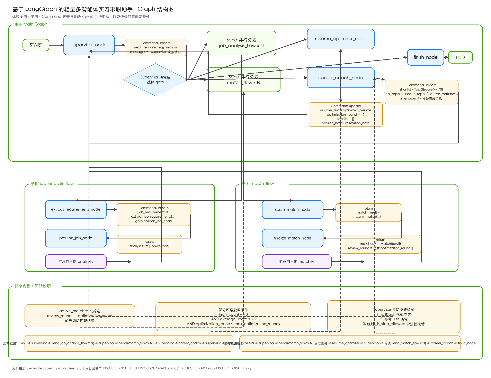

# 基于 LangGraph 的轻量多智能体实习求职助手

一个围绕真实求职任务构建的 `LangGraph` 入门项目。

它不是通用聊天机器人，也不是简单问答 Demo，而是把“岗位分析 -> 简历匹配 -> 低分回路优化 -> 求职建议生成”做成了一张可并行、可回路、可持久化恢复的多智能体状态图。

## 项目亮点

- 面向真实场景：围绕实习 / 校招求职，而不是泛化聊天任务
- 多智能体协作：`Supervisor`、`Job Analyst`、`Resume Reviewer`、`Resume Optimizer`、`Career Coach`
- `LangGraph` 核心能力齐全：`Command`、`Send`、子图、状态汇总、低分回路、checkpoint
- 多模型分工：不同角色可以配置不同模型，体现成本意识
- SQLite 持久化：支持自定义 `thread_id`、会话恢复、历史快照读取
- 可演示前端：基于 `Streamlit` 的登录式工作台 + 独立结果页

## 适合展示什么能力

- 用 `StateGraph` 设计真实业务流程
- 用子图拆分复杂节点
- 用 `Send` 并行处理多岗位分析和匹配
- 用 `Command` 实现状态更新与主动跳转
- 用回路控制低分重试，而不是固定线性流程
- 用 SQLite checkpoint 做状态持久化与会话恢复
- 用轻量前端把 Agent 工作流包装成可展示产品原型

## 核心流程

主流程：

1. `Supervisor` 判断当前阶段
2. 并行分析多个岗位
3. 并行评估岗位与简历匹配度
4. 如果整体匹配偏低，进入简历优化回路
5. 生成最终投递建议与推荐岗位

低分回路触发条件：

- 当前轮没有高匹配岗位
- 当前轮平均分低于阈值
- 当前优化轮次还没有超过上限

## Graph 结构图

下面这张图展示了主图、子图、`Command` 跳转、`Send` 并行汇总和低分回路条件：



如果你想看可编辑版本，也可以直接打开：

- [PROJECT_GRAPH.md](./PROJECT_GRAPH.md)
- [PROJECT_GRAPH.mmd](./PROJECT_GRAPH.mmd)
- [PROJECT_GRAPH.svg](./PROJECT_GRAPH.svg)

## 架构说明

### 主图节点

- `supervisor`
- `job_analysis_flow`
- `match_flow`
- `resume_optimizer`
- `career_coach`
- `finish_node`

### 子图职责

岗位分析子图：

- `extract_requirements_node`
- `position_job_node`

岗位匹配子图：

- `score_match_node`
- `finalize_match_node`

### 关键状态

- `user_goal`
- `resume_text`
- `jobs`
- `analyses`
- `matches`
- `next_step`
- `strategy_reason`
- `optimization_round`
- `max_optimization_rounds`
- `revision_notes`
- `shortlist`
- `final_report`

## 前端能力

当前 `Streamlit` 前端已经不是单纯表单页，而是一个适合演示的轻量产品原型。

支持：

- 本地注册 / 登录
- 用户昵称、账号和个人会话空间
- 会话列表管理，不再直接把 `thread_id` 暴露给普通用户
- 新建分析会话
- 粘贴简历、使用示例简历、上传 `txt / md / pdf` 简历
- 查看当前会话摘要
- 查看历史 checkpoint 快照
- 独立的“最终建议”阅读页
- 历史结果列表与结果页跳转

说明：

- 当前账号系统是本地原型实现，用户信息保存在 `data/app_users.json`
- 它的目的主要是提升演示体验，不是生产级认证系统

## CLI 能力

除了前端，项目也保留了 CLI 入口，方便调试和展示图状态。

支持：

- 启动新分析
- 自定义 `thread_id`
- 查看某个会话当前状态
- 查看历史 checkpoint
- 继续已有会话

常用命令：

```bash
python -m src.main
python -m src.main --thread-id my-first-session
python -m src.main --thread-id my-first-session --show-session
python -m src.main --thread-id my-first-session --show-history
python -m src.main --thread-id my-first-session --continue-session
python -m src.main --thread-id my-first-session --continue-session --user-goal "我想找上海的 AI Agent 实习"
```

## 项目结构

```text
.
├── README.md
├── requirements.txt
├── .env.example
├── streamlit_app.py
├── PROJECT_GRAPH.md
├── PROJECT_GRAPH.mmd
├── PROJECT_GRAPH.svg
├── PROJECT_GRAPH.png
├── generate_project_graph_assets.py
├── data
│   ├── jobs.json
│   ├── sample_resume.md
│   ├── sample_resume.pdf
│   └── app_users.json
├── pages
│   └── 01_Final_Report.py
├── checkpoints
│   └── langgraph_checkpoints.sqlite
└── src
    ├── __init__.py
    ├── agents.py
    ├── frontend_service.py
    ├── graph.py
    ├── main.py
    ├── models.py
    ├── prompts.py
    ├── session_service.py
    └── utils.py
```

## 快速开始

### 1. 安装依赖

```bash
pip install -r requirements.txt
```

### 2. 配置环境变量

```bash
cp .env.example .env
```

在 `.env` 中填写：

```bash
OPENAI_API_KEY=your_api_key_here
OPENAI_BASE_URL=https://api.openai.com/v1
OPENAI_MODEL=gpt-4o-mini
SUPERVISOR_MODEL=gpt-4.1-mini
ANALYST_MODEL=gpt-4o-mini
REVIEWER_MODEL=gpt-4.1
OPTIMIZER_MODEL=gpt-4.1
COACH_MODEL=gpt-4.1
```

如果你使用 OpenAI 兼容接口，也可以替换 `OPENAI_BASE_URL`。

### 3. 启动前端

```bash
streamlit run streamlit_app.py
```

### 4. 或直接使用 CLI

```bash
python -m src.main
```

## 运行数据说明

运行时会生成或更新这些文件：

- `checkpoints/langgraph_checkpoints.sqlite`
- `checkpoints/langgraph_checkpoints.sqlite-shm`
- `checkpoints/langgraph_checkpoints.sqlite-wal`
- `data/app_users.json`

如果你准备把项目推送到 GitHub，通常不建议提交：

- `.env`
- `checkpoints/` 下的运行时数据库文件
- `data/app_users.json` 这类本地测试账号数据

## 技术栈

- Python 3.13
- LangGraph
- langchain-openai
- langchain-core
- SQLite checkpoint
- Streamlit
- pypdf
- python-dotenv

## 当前版本定位

这是一个适合学习、展示和继续扩展的第二版 MVP。

它的优势不在“完全开放式自主代理”，而在：

- 业务场景真实
- 图结构清晰
- 工程设计稳定
- 可解释、可演示、可恢复

对于第一段中小厂后端 / AI 应用实习，这样的项目已经具备不错的展示价值。

## 后续可扩展方向

- 抽出 `FastAPI` 接口层，为 `Vue` 前端做准备
- 对接真实岗位抓取或岗位管理后台
- 增加投递记录、岗位收藏、技能缺口追踪
- 增加人工确认节点
- 从 SQLite checkpoint 升级到 Postgres
- 增加面试题生成与投递策略跟踪

## 简历 / 面试可讲点

- 为什么第一版不够像图，第二版为什么要重构
- 为什么 `Supervisor` 不能完全放飞，而要有 fallback 和合法性约束
- 为什么匹配结果要按 `review_round` 区分轮次
- 为什么岗位分析和岗位匹配都要用 `Send`
- 为什么要引入低分回路，而不是线性流程
- 为什么不同角色要使用不同模型
- 为什么从 `MemorySaver` 升级到 SQLite checkpoint
- 为什么前端先选 `Streamlit`，而不是一开始就上前后端分离

## License

如果你准备开源，建议补一个你自己的 License 文件后再推送到 GitHub。
