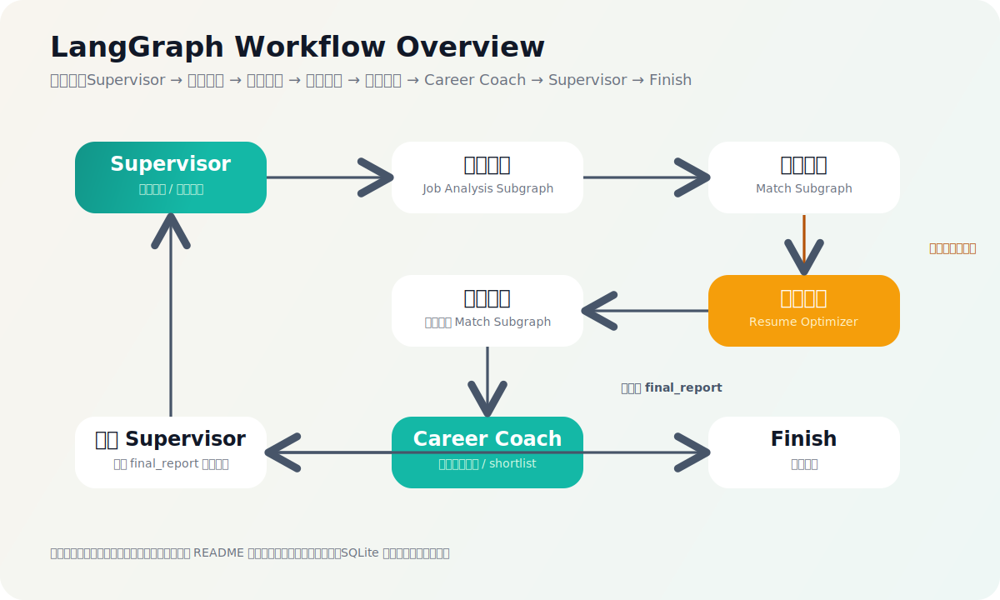

# LangGraph Multi-Agent Career Assistant

一个围绕真实求职任务构建的多智能体 AI 应用项目。  
项目以 `LangGraph` 为工作流编排核心，围绕岗位分析、简历匹配、低分回路优化和最终求职建议生成构建可并行、可回路、可恢复的状态图系统，并进一步升级为 `Vue + FastAPI + Docker Compose` 的完整前后端分离版本。



## 项目简介

这个项目不是简单聊天机器人，也不是普通问答 Demo，而是一个更贴近真实业务的小型智能系统：

- 用户可以注册 / 登录并拥有自己的分析空间
- 用户可以创建多个分析会话并基于 `thread_id` 持续追踪状态
- 用户可以输入求职目标、粘贴简历或上传简历文件
- 系统会并行分析多个岗位、评估简历匹配度、在必要时触发简历优化回路
- 最终输出结构化岗位分析结果与自然语言求职建议

## 核心亮点

- 真实场景驱动：围绕“找第一段实习”设计业务流程，而不是泛化聊天
- 多智能体协作：`Supervisor`、`Job Analyst`、`Resume Reviewer`、`Resume Optimizer`、`Career Coach`
- `LangGraph` 核心能力完整落地：`Command`、`Send`、子图、状态聚合、低分回路、checkpoint
- 多模型分工：支持按角色分配不同模型，兼顾效果与成本
- `SQLite checkpoint`：支持自定义 `thread_id`、会话恢复、历史快照读取
- 前后端分离：`FastAPI` 后端 + `Vue 3 + Vite` 前端
- Docker 部署：支持通过 `docker compose up --build` 一键启动

## 技术栈

- Python 3.13
- LangGraph
- langchain-openai
- FastAPI
- Vue 3
- Vite
- SQLite
- Docker Compose
- Nginx
- pypdf

## 系统流程

### 主流程

1. `Supervisor` 根据当前状态决定下一步动作
2. 使用 `Send` 并行分发岗位到岗位分析子图
3. 使用 `Send` 并行分发岗位到匹配子图
4. 如果当前轮整体匹配偏低，则进入简历优化回路
5. `Career Coach` 生成最终报告与推荐岗位

### 岗位分析子图

- `extract_requirements_node`
- `position_job_node`

### 匹配子图

- `score_match_node`
- `finalize_match_node`

### 低分回路触发条件

- 当前轮没有高匹配岗位
- 当前轮平均分低于阈值
- 当前优化轮次未超过上限

## 项目结构

```text
.
├── README.md
├── requirements.txt
├── docker-compose.yml
├── .env.example
├── backend
│   ├── Dockerfile
│   └── app
│       ├── __init__.py
│       ├── main.py
│       └── schemas.py
├── frontend
│   ├── Dockerfile
│   ├── index.html
│   ├── nginx.conf
│   ├── package.json
│   ├── package-lock.json
│   ├── tsconfig.json
│   ├── vite.config.ts
│   └── src
│       ├── api.ts
│       ├── App.vue
│       ├── main.ts
│       ├── styles.css
│       └── types.ts
├── docs
│   └── graph-overview.svg
├── data
│   ├── jobs.json
│   ├── sample_resume.md
│   └── sample_resume.pdf
└── src
    ├── __init__.py
    ├── agents.py
    ├── auth_service.py
    ├── graph.py
    ├── main.py
    ├── models.py
    ├── prompts.py
    ├── resume_parser.py
    ├── session_service.py
    └── utils.py
```

## 后端能力（FastAPI）

主要接口：

- `POST /api/auth/register`
- `POST /api/auth/login`
- `GET /api/auth/me`
- `GET /api/jobs`
- `GET /api/sessions`
- `POST /api/sessions`
- `POST /api/sessions/{thread_id}/activate`
- `GET /api/sessions/{thread_id}`
- `GET /api/sessions/{thread_id}/history`
- `POST /api/analysis/run`
- `GET /api/health`

后端职责：

- 用户认证与本地账户管理
- 会话与 `thread_id` 管理
- 调用 LangGraph 图执行求职分析
- 读取 SQLite checkpoint 当前状态与历史快照
- 处理 `txt / md / pdf` 简历上传

## 前端能力（Vue）

前端工作台支持：

- 注册 / 登录
- 查看并切换历史会话
- 新建分析会话
- 输入求职目标和用户消息
- 粘贴简历文本或上传简历文件
- 启动新分析 / 继续历史会话
- 查看最终报告
- 查看当前会话摘要
- 查看历史快照
- 查看岗位分析结果和当前轮匹配结果

## 本地开发

### 1. 安装 Python 依赖

```bash
pip install -r requirements.txt
```

### 2. 配置环境变量

```bash
cp .env.example .env
```

`.env` 示例：

```bash
OPENAI_API_KEY=your_api_key_here
OPENAI_BASE_URL=https://api.openai.com/v1
OPENAI_MODEL=gpt-4o-mini
SUPERVISOR_MODEL=gpt-4.1-mini
ANALYST_MODEL=gpt-4o-mini
REVIEWER_MODEL=gpt-4.1
OPTIMIZER_MODEL=gpt-4.1
COACH_MODEL=gpt-4.1
APP_AUTH_SECRET=replace-with-your-own-secret
```

### 3. 启动后端

```bash
uvicorn backend.app.main:app --reload --host 127.0.0.1 --port 8000
```

### 4. 启动前端

```bash
cd frontend
npm install
npm run dev -- --host 127.0.0.1 --port 5173
```

访问：

- 前端：`http://127.0.0.1:5173`
- 后端健康检查：`http://127.0.0.1:8000/api/health`

## Docker 部署

在项目根目录执行：

```bash
docker compose up --build
```

后台运行：

```bash
docker compose up --build -d
```

访问：

- 前端：`http://localhost:5173`
- 后端：`http://localhost:8000`
- 健康检查：`http://localhost:8000/api/health`

## 运行时数据说明

这些文件通常不建议提交：

- `.env`
- `checkpoints/`
- `data/app_users.json`
- `frontend/node_modules/`
- `frontend/dist/`

当前 `.gitignore` 已忽略这些本地运行数据。

## 适合在简历和面试中展示的点

- 用 `LangGraph` 把真实业务流程而不是简单问答做成状态图
- 使用 `Command`、`Send`、子图、低分回路和 SQLite checkpoint
- 使用 `FastAPI` 封装工作流与会话管理接口
- 使用 `Vue` 构建独立工作台，完成前后端联调
- 使用 Docker Compose 做完整部署验证
